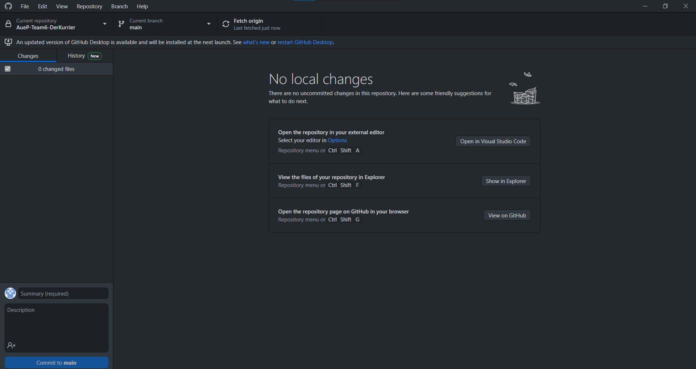
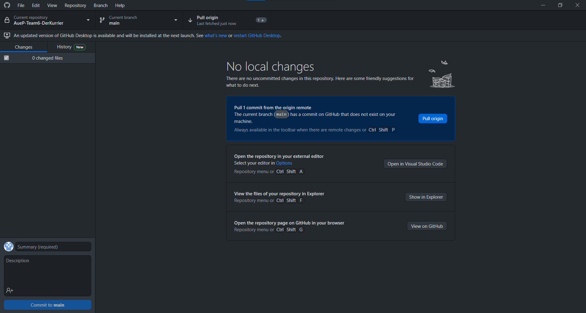
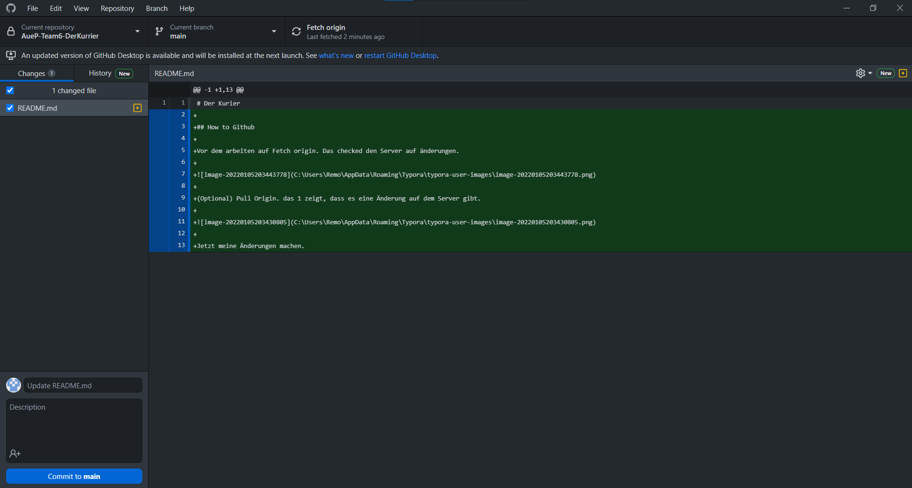
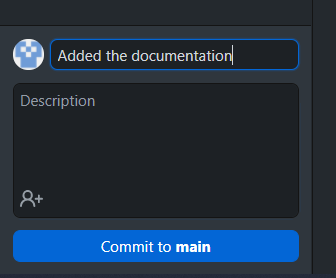
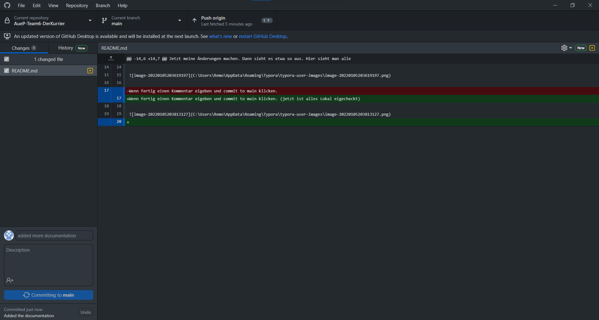

# Der Kurier

## How to Github

Vor dem arbeiten auf Fetch origin. Das checked den Server auf änderungen.

(Optional) Pull Origin. das 1 zeigt, dass es eine Änderung auf dem Server gibt.

Jetzt meine Änderungen machen. Dann sieht es etwa so aus. Hier sieht man alle änderungen an den Files.

Wenn fertig einen Kommentar eigeben und commit to main klicken. (jetzt ist alles Lokal eigecheckt)

Jetzt auf Push origin klicken, das 1 symbolisiert wie viele commits raufgeladen werden.

Jetzt ist es auf dem Server
